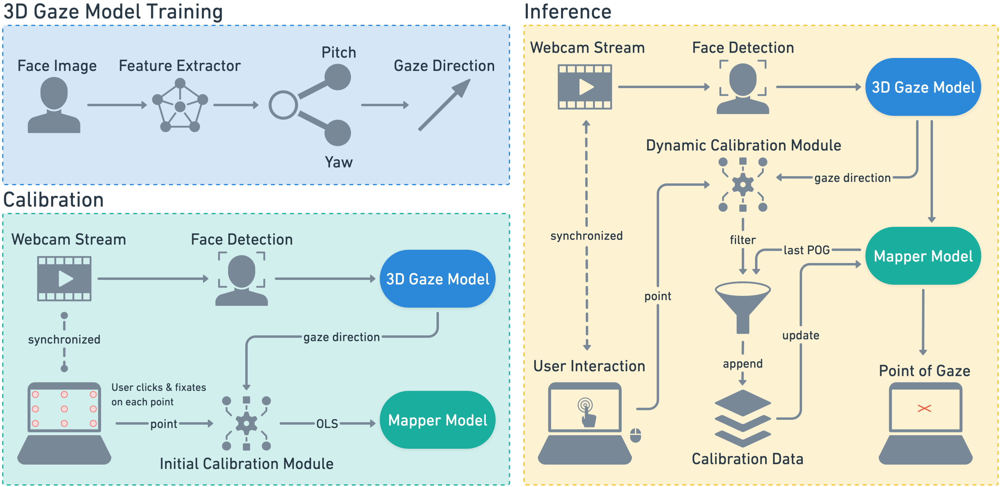

# GLAMIA

**Accessible Real-Time Gaze Estimation Framework via 3D Gaze Direction, Linear Mapping, and Implicit Adaptation**

This repository contains the official implementation and supplementary materials for the paper: `GLAMIA: Accessible Real-Time Gaze Estimation Framework via 3D Gaze Direction, Linear Mapping, and Implicit Adaptation`.

> 📄 **Paper**: *TODO — arXiv preprint link will be added here.*

## Overview



GLAMIA is a framework that turn any desktop/laptop with webcam into a real-time point-of-gaze tracker (screen-based).

This codebase includes training, evaluation, demo, as well as pretrained weights and configuration files.

## Demo

**In-the-wild Gamified Platform User Study Example**:


https://github.com/user-attachments/assets/d64d8568-01e1-4091-8588-37c96e33969d

**Another Demo**:


https://github.com/user-attachments/assets/315a746a-9941-411b-80d6-78e25347afed

## Repository layout
```
glamia/
├── assets/                  # Overview + demo videos
├── weights/                 # Released checkpoints
├── results/                 # Reference benchmark outputs reported in the paper
├── inference/               # uv project: pipeline, webcam demo, public benchmarks
│   ├── demo.py              # Live 9-point calibration + point-of-gaze webcam demo
│   ├── benchmarks/EVE/      # Paper evaluation on EVE
│   ├── benchmarks/MPIIFaceGaze/
│   ├── mediapipe_models/    # BlazeFace face detector
│   └── src/                 # GazePipeline3D/2D, Mapper, model definitions
└── training/                # uv project: 3D backbone training
    ├── configs/             # Gaze360 / MPIIFaceGaze training configs
    ├── preprocessing/       # Dataset preprocessing
    ├── mpii_loocv/          # Leave-one-person-out protocol for MPIIFaceGaze
    └── src/                 # Models, datasets, losses, metrics
```

## Installation

This repository uses [uv](https://docs.astral.sh/uv/) (Python 3.12):

```bash
# Inference, benchmarks, and demo:
cd inference
uv sync

# Training (separate environment):
cd training
uv sync
```

## Quickstart: webcam demo

Run the interactive demo — 9-point calibration followed by live point-of-gaze estimation on your screen:

```bash
cd inference
uv run demo.py --weights ../weights/glamia_gaze360_mobileone_s1.pth
```

## Reproducing the EVE benchmark

1. Obtain the [EVE dataset](https://ait.ethz.ch/eve) and extract it so that the repository root contains `datasets/extracted/EVE/` with `train01–39/` and `val01–05/`.
2. Extract 3D gaze features with the released checkpoint (GPU recommended; the 44-subject cohort is ~1.5M frames):

```bash
cd inference
uv run benchmarks/EVE/extract_features.py --split val    # val01–05
uv run benchmarks/EVE/extract_features.py --split train  # train01–39
```

3. Run the benchmark:

```bash
uv run benchmarks/EVE/benchmark.py --split all   # 44 subjects → 138.97 px / 40.02 mm
uv run benchmarks/EVE/benchmark.py --split val   # 5 subjects  → 127.42 px / 36.70 mm
```

Outputs are written to `experiments/eve/` at the repository root; reference copies are in [`results/eve/`](results/eve/). Full methodology and per-split details: [`inference/benchmarks/EVE/README.md`](inference/benchmarks/EVE/README.md).

Optionally, run the [MPIIFaceGaze benchmark](inference/benchmarks/MPIIFaceGaze/README.md).

## Training the 3D backbone

```bash
# 1. Preprocess raw datasets (see training/preprocessing/README.md for download notes):
uv run preprocessing/gaze360.py --raw-dir data/raw/Gaze360 --output-dir data/preprocessed/Gaze360
uv run preprocessing/mpiifacegaze.py --raw-dir data/raw/MPIIFaceGaze --output-dir data/preprocessed/MPIIFaceGaze

# 2. Train model:
uv run train.py --config configs/gaze360_train.yaml
```

See [`training/README.md`](training/README.md) for details.

## Model weights

| File | Model | Training data | Notes |
|---|---|---|---|
| `weights/glamia_gaze360_mobileone_s1.pth` | MobileOne-S1 | Gaze360 | Fused (reparameterized) |

Load it with `GazePipeline3D` in [`inference/src/`](inference/src/), or pass its path to any script via `--weights` flag.

## Citation

If you use GLAMIA, please cite:

```bibtex
@article{taneri2026glamia,
  title   = {GLAMIA: Accessible Real-Time Gaze Estimation Framework via 3D Gaze Direction,
             Linear Mapping, and Implicit Adaptation},
  author  = {Taneri, Vincent and Lee, Greg C.},
  journal = {arXiv preprint arXiv:TODO},
  year    = {2026}
}
```

## Acknowledgements

- [GazeHub @ Phi-ai Lab](https://phi-ai.buaa.edu.cn/Gazehub/) — dataset preprocessing library.
- [Apple MobileOne](https://github.com/apple/ml-mobileone) — backbone architecture.
- [Google MediaPipe](https://developers.google.com/mediapipe) — BlazeFace face detection.
- The authors of EVE, Gaze360, and MPIIGaze/MPIIFaceGaze for releasing their datasets.
